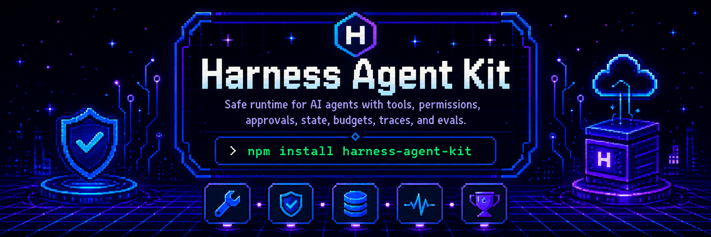

# Harness Agent Kit



[](https://github.com/ivanshtokov/AgentHarnessKit/actions/workflows/ci.yml)
[](package.json)
[](package.json)
[](LICENSE)

Стартовый набор для агентного харнесса: typed tools, permission engine, approval gates, durable state, budgets, trace events, context builder, provider adapters, reference-layer, templates и native-интеграция для Codex/Hermes.

Репозиторий: [ivanshtokov/AgentHarnessKit](https://github.com/ivanshtokov/AgentHarnessKit)

Контакт: [@IShtokov](https://t.me/IShtokov)

## Зачем

LLM не должна быть оператором с прямым доступом к системам. Модель предлагает шаг. Харнесс проверяет, можно ли этот шаг выполнять.

```text
model proposes
harness validates
harness authorizes
harness executes
harness records
model receives observation
```

Практический смысл:

- модель не отправляет письма сама;
- модель не пишет в базу сама;
- модель не деплоит сама;
- модель не решает, можно ли нарушить policy;
- runtime хранит approvals, state, budgets и trace вне prompt.

## Что внутри

- Zero-dependency Node.js runtime.
- Tool registry со schema validation и timeouts.
- Permission engine с risk classes и args-bound approvals.
- Memory/file state store для tasks, approvals, artifacts, checkpoints.
- Budget controller для steps, tool calls, retries, cost.
- Trace recorder без hidden reasoning.
- Context builder со stable prefix и dynamic suffix.
- Provider adapter skeletons для OpenAI Responses, Anthropic Messages, OpenAI-compatible chat completions.
- Executable eval runner.
- Approval-gated пример renewal-risk агента.
- Полный reference-layer по проектированию агентных харнессов.
- Native Codex skill/plugin layout.
- Native Hermes skill layout.
- CI, security policy, contributing guide, changelog.

## Быстрый старт

```bash
git clone https://github.com/ivanshtokov/AgentHarnessKit.git
cd AgentHarnessKit
npm install
npm test
npm run verify:integrations
npm run example:renewal-risk
```

Ожидаемый результат:

- тесты проходят;
- integration verifier подтверждает Codex/Hermes layout;
- пример сначала останавливается на `needs_approval`;
- после approval record выполняет `send_customer_email`;
- trace показывает tool proposal, permission decision и execution result.

## Установка как библиотека

Пока пакет не опубликован в npm, ставь из GitHub:

```bash
npm install github:ivanshtokov/AgentHarnessKit
```

Использование:

```js
import { createHarness, riskClasses } from "harness-agent-kit";

const harness = createHarness({
  model,
  tools: [
    {
      name: "read_customer_profile",
      description: "Read a customer profile by id.",
      riskClass: riskClasses.READ_ONLY,
      inputSchema: {
        type: "object",
        required: ["customerId"],
        properties: {
          customerId: { type: "string" }
        }
      },
      async execute({ customerId }) {
        return {
          status: "success",
          data: { customerId, segment: "enterprise" }
        };
      }
    }
  ]
});

const result = await harness.run({
  id: "task_001",
  objective: "Prepare a customer risk brief."
});
```

## Codex

Repo уже содержит Codex-native layout:

```text
.agents/skills/harness-agent-kit/
.agents/plugins/marketplace.json
plugins/harness-agent-kit/.codex-plugin/plugin.json
AGENTS.md
```

В Codex repo skill можно вызывать явно:

```text
$harness-agent-kit audit this agent harness
```

Для plugin marketplace см. [docs/codex-integration.ru.md](docs/codex-integration.ru.md).

## Hermes Agent

Repo содержит Hermes tap layout:

```text
skills/harness-agent-kit/
```

После публикации repo:

```bash
hermes skills tap add ivanshtokov/AgentHarnessKit
hermes skills install ivanshtokov/AgentHarnessKit/harness-agent-kit
```

Для `delegate_task` и cron используй:

- [templates/harness-boot-contract.md](templates/harness-boot-contract.md)
- [templates/delegate-task-prompt.md](templates/delegate-task-prompt.md)
- [templates/hermes-cron-prompt.md](templates/hermes-cron-prompt.md)

Подробно: [docs/hermes-integration.ru.md](docs/hermes-integration.ru.md).

## Provider adapters

Core runtime не тянет provider SDK. Ты передаёшь уже созданный client.

OpenAI Responses:

```js
import OpenAI from "openai";
import { createOpenAIResponsesAdapter } from "harness-agent-kit";

const client = new OpenAI();
const model = createOpenAIResponsesAdapter({
  client,
  model: "gpt-5.1"
});
```

Anthropic Messages:

```js
import Anthropic from "@anthropic-ai/sdk";
import { createAnthropicMessagesAdapter } from "harness-agent-kit";

const client = new Anthropic();
const model = createAnthropicMessagesAdapter({
  client,
  model: "claude-sonnet-4-5"
});
```

OpenAI-compatible chat completions:

```js
import OpenAI from "openai";
import { createOpenAICompatibleChatAdapter } from "harness-agent-kit";

const client = new OpenAI({
  baseURL: "https://your-provider.example/v1",
  apiKey: process.env.PROVIDER_API_KEY
});

const model = createOpenAICompatibleChatAdapter({
  client,
  model: "provider-model-name"
});
```

Документ: [docs/provider-adapters.ru.md](docs/provider-adapters.ru.md).

## Базовый loop

```text
user/task
  -> instruction builder
  -> context builder
  -> model call
  -> tool/action proposal
  -> schema validation
  -> permission decision
  -> execution or approval pause
  -> structured observation
  -> context/state update
  -> repeat within budget or finish
```

## Runtime API

- `createHarness` — запускает model-tool-observation loop.
- `createToolRegistry` — регистрирует typed tools, валидирует args, применяет timeout.
- `createDefaultPermissionEngine` — решает `allow`, `deny`, `ask_approval`.
- `createMemoryStateStore` — хранит runtime state в памяти.
- `createFileStateStore` — хранит runtime state в JSON-файле.
- `createBudgetController` — контролирует steps, tool calls, retries, cost.
- `createTraceRecorder` — пишет runtime events.
- `createContextBuilder` — собирает stable prefix и dynamic suffix.
- `runHarnessEvals` — запускает executable eval cases.

## Risk classes

```text
read_only
internal_draft
internal_write
external_communication
financial_action
legal_or_regulated
destructive_action
privileged_action
```

Default policy:

- `read_only` — автономно;
- `internal_draft` — автономно;
- все остальные — через approval.

Approval привязан к `taskId`, `toolName`, `riskClass` и hash аргументов. Нельзя утвердить один email и отправить другой тем же approval.

## Структура

```text
AgentHarnessKit/
  AGENTS.md
  SKILL.md
  README.md
  package.json
  src/
    adapters/
    evals/
    runtime/
  references/
  templates/
  docs/
  examples/
  test/
  skills/harness-agent-kit/
  .agents/skills/harness-agent-kit/
  plugins/harness-agent-kit/
```

## Reference-layer

`references/` содержит полный методологический слой по проектированию агентных харнессов:

- provider API patterns;
- prompt caching and cost;
- skills, MCP, connectors;
- system prompts and instruction hierarchy;
- security, evals, observability;
- agent legibility and feedback loops;
- coverage audit;
- source links.

Источник reference-layer указан в [NOTICE.md](NOTICE.md).

## Subagents, delegate_task, cron

Изолированные workers не обязаны наследовать parent context.

Правило:

- Codex subagent получает [templates/harness-boot-contract.md](templates/harness-boot-contract.md).
- Hermes `delegate_task` использует [templates/delegate-task-prompt.md](templates/delegate-task-prompt.md).
- Hermes cron использует [templates/hermes-cron-prompt.md](templates/hermes-cron-prompt.md) и `skills: ["harness-agent-kit"]`.

Verifier проверяет, что эти templates лежат во всех Codex/Hermes skill packages.

## Команды

```bash
npm run sync:skills
npm run verify:integrations
npm test
npm run example:renewal-risk
```

## Что ещё не является production-гарантией

- Нет жёсткого process sandbox.
- Нет встроенного auth provider.
- Нет distributed trace exporter.
- Streaming adapters пока не реализованы.
- MCP connector runtime пока не реализован.

Это starter kit с production-oriented contract, а не готовая hosted platform.

## Документы

- [Codex integration](docs/codex-integration.ru.md)
- [Hermes integration](docs/hermes-integration.ru.md)
- [Provider adapters](docs/provider-adapters.ru.md)
- [Runtime hardening](docs/runtime-hardening.ru.md)
- [Production checklist](docs/production-checklist.ru.md)
- [Reference map](docs/reference-map.ru.md)

## Разработка

См. [CONTRIBUTING.md](CONTRIBUTING.md), [SECURITY.md](SECURITY.md), [CHANGELOG.md](CHANGELOG.md).

## Лицензия

MIT. См. [LICENSE](LICENSE).
